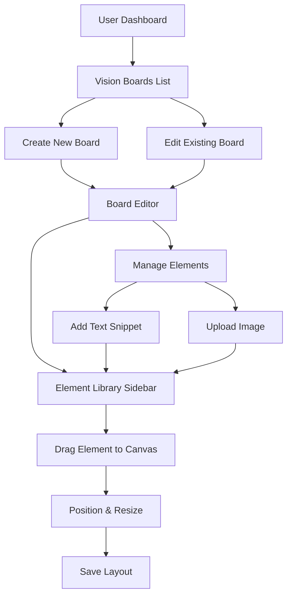

# Vision Board Scrapbook Enhancement Plan

## Overview
Transform vision boards from simple text entries into interactive digital scrapbooks where users can drag and drop visual elements (images and text snippets) from their personal collection onto a canvas.

## Current State
- VisionBoard model has `elements` JSONField (currently unused in UI)
- Basic CRUD operations for vision boards
- Static detail view showing only title/description

## Proposed Architecture

### Models

```python
class VisionElement(models.Model):
    """User's personal collection of visual elements"""
    ELEMENT_TYPES = [
        ('text', 'Text Snippet'),
        ('image', 'Image'),
        ('quote', 'Quote'),
    ]

    user = models.ForeignKey(User, on_delete=models.CASCADE, related_name='vision_elements')
    element_type = models.CharField(max_length=10, choices=ELEMENT_TYPES)
    title = models.CharField(max_length=200, blank=True)
    content = models.TextField(help_text="Text content or image URL")
    image = models.ImageField(upload_to='vision_elements/', blank=True, null=True)
    color = models.CharField(max_length=7, default='#ffffff', help_text='Background color for text elements')
    font_size = models.IntegerField(default=16)
    created_at = models.DateTimeField(auto_now_add=True)

class VisionBoardElement(models.Model):
    """Positions elements on vision boards"""
    vision_board = models.ForeignKey(VisionBoard, on_delete=models.CASCADE, related_name='board_elements')
    vision_element = models.ForeignKey(VisionElement, on_delete=models.CASCADE)
    x_position = models.IntegerField(default=0)
    y_position = models.IntegerField(default=0)
    width = models.IntegerField(default=200)
    height = models.IntegerField(default=150)
    z_index = models.IntegerField(default=0)
    rotation = models.IntegerField(default=0)
```

### UI Components

#### 1. Element Library Management
- Grid view of user's personal elements
- Add new text snippets with styling options
- Upload images with preview
- Edit/delete existing elements

#### 2. Vision Board Editor
- Canvas area (800x600px minimum)
- Left sidebar: draggable element thumbnails
- Drag elements from sidebar to canvas
- Resize, rotate, reposition elements on canvas
- Save layout automatically or on demand

#### 3. Board Gallery
- Grid of user's vision boards
- Preview thumbnails showing element layout
- Quick actions: edit, duplicate, delete

### Technical Implementation

#### Frontend
- HTML5 Canvas or positioned divs for board layout
- Drag and drop API (native or library like SortableJS)
- AJAX for saving positions
- Image upload with preview
- Text editing in place

#### Backend
- REST API endpoints for elements and board layouts
- Image upload handling
- Position validation and collision detection
- Migration for existing JSON elements

### User Flow



### API Endpoints

- `GET/POST /api/vision-elements/` - CRUD for personal elements
- `GET/POST /api/vision-boards/{id}/elements/` - Board element positions
- `PATCH /api/vision-boards/{id}/layout/` - Save board layout

### Migration Strategy

1. Create new models
2. Migrate existing JSON elements to VisionElement instances
3. Update VisionBoard.elements to use new structure
4. Update templates and views
5. Add JavaScript functionality

### Success Criteria

- Users can create personal element collections
- Intuitive drag-and-drop board creation
- Responsive canvas with proper positioning
- Automatic saving of layouts
- Visual feedback during interactions
- Mobile-friendly interface

## Implementation Phases

### Phase 1: Data Model
- Create VisionElement and VisionBoardElement models
- Database migration
- Update serializers

### Phase 2: Element Management
- CRUD views for personal elements
- Upload handling for images
- Element library UI

### Phase 3: Board Editor
- Interactive canvas component
- Drag and drop functionality
- Position saving

### Phase 4: Integration
- Update existing board views
- Add navigation to new features
- Testing and refinement